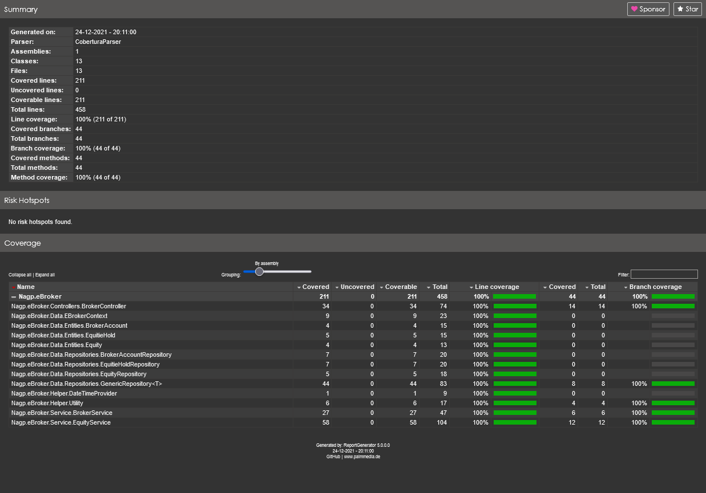

# Nagp.eBroker
EBroker assignment for unit test

## Step to run webAPI [Nagp.eBroker](https://github.com/irfanali915/Nagp.eBroker)  
1. Open solution file in visual studio located at root [Nagp.eBroker.sln](/Nagp.eBroker.sln)
    1. Set docker-compose project as startup project
    1. Now just run project. 
1. Running via dotnet CLI
    1. OPen CMD and change directory to [\src\Nagp.eBroker](/src/Nagp.eBroker)
    1. Execute command `dotnet run`

## Step to run unit test [Nagp.eBroker.UnitTests](/src/Nagp.eBroker.UnitTests)
1. You can use test explorer of visual studio.
1. For generating code covrage report use dotnet CLI  
  `dotnet test --collect:"XPlat Code Coverage"`
1. above command will generate covrage file with name `coverage.cobertura.xml` inside TestResult folder.  
  
